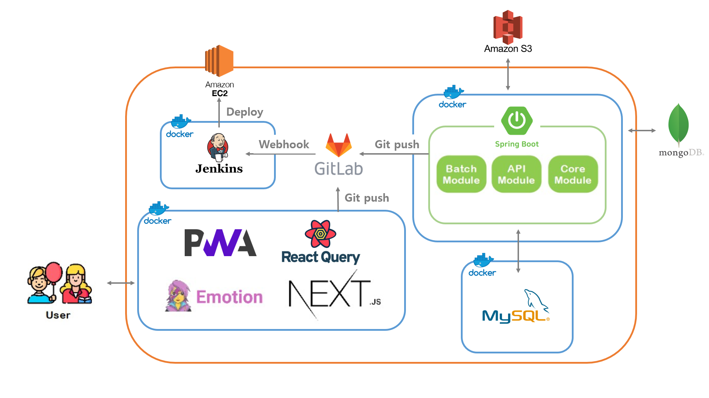
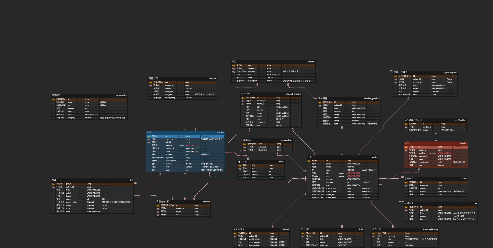

# 👨‍👩‍👧‍👦 아이코(ICO)


- SSAFY 8th PJT **Team D103**​ 🌞
- 프로젝트 기간 : `2023.04.10` ~ `2023.05.19`
- 구성원 : 강교철, 김동주, 변윤경, 사공지은, 서재건, 오민준  
- 팀 노션 : <a href="" target="_blank">👉 아이코(ICO) Notion 👈</a>

<br>

# 📌 ​Contents

[:one: Introduction](#one-introduction)<br>
[:two:​ Tech Stack](#two-tech-stack)<br>
[:three:​ System Architecture](#three-system-architecture)<br>
[:four:​ ERD](#four-erd)<br>
[:five:​ Package Structure](#five-package-structure)<br>
[:six:​ API Document](#six-api-document)<br>
[:seven:​ Contributor](#seven-contributor)<br>


<br>

## ​:one: Introduction
[시연 시나리오](https://lab.ssafy.com/s08-final/S08P31D103/-/raw/main/exec/D103_ICO_%EC%8B%9C%EC%97%B0_%EC%8B%9C%EB%82%98%EB%A6%AC%EC%98%A4.pdf?inline=false)

<br>

## ​:two:​ Tech Stack

| Tech         | Stack                                  |
| ------------ | -------------------------------------- |
| **Language** | Java, TypeScript                       |
| **Back-end**  | SpringBoot, JWT |
| **Front-end** | React.js, tailwind, Recoil                  |
| **Database** | MySQL, MongoDB, S3                                |
| **Server**   | AWS EC2, Nginx                         |
| **DevOps**   | Git, Docker, Jenkins                            |


<details>
<summary>Front-end Tech 상세 보기</summary>
<div markdown="1">

  <br>

```
- TypeScript: 5.0.4
- @types/node: 18.16.0
- @types/react: ^18.2.6
- next: 13.3.1
- next-pwa: ^5.6.0
- @tanstack/react-query: ^4.29.3
- jotai: ^2.0.4
- axios: ^1.3.6
- @emotion/react: ^11.10.6
```
</div>
</details>


<details>
<summary>Back-end Tech 상세 보기</summary>
<div markdown="1">

  <br>

```
- Java: 11
- SpringBoot: 2.7.11
- MySQL: 8.0.29
- MongoDB: 5.0.17
- Docker: 23.0.4
- Docker-compose: 1.29.2
- Jenkins: 2.387.2
- Nginx: 1.18.0
```
</div>
</details>


<br>

## :three:​ System Architecture



<br>

## :four:​ ERD



<br>

## :five: Package Structure

<details>
<summary>Front-end Package Structure</summary>
<div markdown="1">

```
└─ 📂ico
    ├─ 📂public
    │  ├─ 📂assets
    │  │  ├─ 📂check
    │  │  ├─ 📂create
    │  │  ├─ 📂deposit
    │  │  ├─ 📂dock
    │  │  ├─ 📂enter
    │  │  ├─ 📂guide
    │  │  ├─ 📂home
    │  │  ├─ 📂job
    │  │  ├─ 📂login
    │  │  ├─ 📂side_menu
    │  │  └─ 📂signup
    │  └─ 📂icons
    └─ 📂src
        ├─ 📂api
        │  ├─ 📂admin
        │  ├─ 📂common
        │  │  └─ 📂shop
        │  ├─ 📂student
        │  │  ├─ 📂class
        │  │  ├─ 📂finance
        │  │  ├─ 📂gov
        │  │  ├─ 📂home
        │  │  ├─ 📂shop
        │  │  └─ 📂user
        │  └─ 📂teacher
        │      ├─ 📂class
        │      ├─ 📂finanace
        │      ├─ 📂gov
        │      ├─ 📂shop
        │      └─ 📂user
        ├─ 📂components
        │  ├─ 📂common
        │  │  ├─ 📂AnimatedRenderer
        │  │  ├─ 📂Button
        │  │  ├─ 📂Card
        │  │  ├─ 📂Carousel
        │  │  ├─ 📂Dropdown
        │  │  ├─ 📂Input
        │  │  ├─ 📂Layout
        │  │  ├─ 📂LoadImage
        │  │  ├─ 📂Modal
        │  │  ├─ 📂Portal
        │  │  ├─ 📂ShowQR
        │  │  ├─ 📂StackNotification
        │  │  ├─ 📂SwipeableGallery
        │  │  └─ 📂TableGenerator
        │  ├─ 📂student
        │  │  ├─ 📂Class
        │  │  │  ├─ 📂JobSearch
        │  │  │  └─ 📂Students
        │  │  ├─ 📂common
        │  │  │  ├─ 📂ContentWrapper
        │  │  │  └─ 📂Loading
        │  │  ├─ 📂Finance
        │  │  │  ├─ 📂Deposit
        │  │  │  │  ├─ 📂DetailPage
        │  │  │  │  ├─ 📂GuidePage
        │  │  │  │  └─ 📂Modal
        │  │  │  └─ 📂Invest
        │  │  │      ├─ 📂Chart
        │  │  │      ├─ 📂IssueList
        │  │  │      └─ 📂Modal
        │  │  ├─ 📂Gov
        │  │  │  ├─ 📂Job
        │  │  │  └─ 📂Rule
        │  │  ├─ 📂Home
        │  │  │  ├─ 📂Asset
        │  │  │  ├─ 📂AssetDetail
        │  │  │  ├─ 📂Coupon
        │  │  │  ├─ 📂GradationButton
        │  │  │  ├─ 📂JobCard
        │  │  │  ├─ 📂SideMenu
        │  │  │  └─ 📂Tip
        │  │  ├─ 📂layout
        │  │  │  ├─ 📂NavBar
        │  │  │  ├─ 📂PageHeader
        │  │  │  ├─ 📂PageLoading
        │  │  │  ├─ 📂TabMenu
        │  │  │  └─ 📂TransitionWrapper
        │  │  └─ 📂Shop
        │  │      ├─ 📂QRScanner
        │  │      └─ 📂ShopCreate
        │  └─ 📂teacher
        │      ├─ 📂Class
        │      │  ├─ 📂Coupon
        │      │  ├─ 📂JobSearch
        │      │  ├─ 📂Property
        │      │  └─ 📂Student
        │      │      ├─ 📂Detail
        │      │      └─ 📂List
        │      ├─ 📂common
        │      │  ├─ 📂CollapseMenu
        │      │  ├─ 📂CommonListElement
        │      │  ├─ 📂Form
        │      │  ├─ 📂KebabMenu
        │      │  └─ 📂Pagination
        │      ├─ 📂Finance
        │      │  ├─ 📂Deposit
        │      │  └─ 📂Invest
        │      ├─ 📂Gov
        │      │  ├─ 📂Exchequer
        │      │  ├─ 📂Job
        │      │  └─ 📂Rule
        │      ├─ 📂layout
        │      │  └─ 📂SideBar
        │      ├─ 📂Shop
        │      │  └─ 📂Create
        │      └─ 📂Signup
        │          └─ 📂SignupIcons
        ├─ 📂hooks
        ├─ 📂pages
        │  ├─ 📂admin
        │  ├─ 📂student
        │  │  ├─ 📂class
        │  │  ├─ 📂finance
        │  │  │  ├─ 📂deposit
        │  │  │  └─ 📂invest
        │  │  ├─ 📂gov
        │  │  │  ├─ 📂exchequer
        │  │  │  ├─ 📂job
        │  │  │  └─ 📂rule
        │  │  ├─ 📂home
        │  │  │  ├─ 📂asset
        │  │  │  ├─ 📂coupon
        │  │  │  └─ 📂exchequer
        │  │  └─ 📂shop
        │  │      ├─ 📂student
        │  │      └─ 📂teacher
        │  └─ 📂teacher
        │      ├─ 📂class
        │      ├─ 📂finance
        │      ├─ 📂gov
        │      │  ├─ 📂exchequer
        │      │  ├─ 📂job
        │      │  └─ 📂rule
        │      └─ 📂shop
        │          ├─ 📂my
        │          └─ 📂student
        ├─ 📂store
        ├─ 📂styles
        ├─ 📂types
        │  ├─ 📂admin
        │  ├─ 📂common
        │  ├─ 📂student
        │  └─ 📂teacher
        └─ 📂util
```

</div>
</details>

<details>
<summary>Back-end Package Structure</summary>
<div markdown="1">

```
📦Back-end
 ┣ 📂api-module
 ┃ ┣ 📂src
 ┃ ┃ ┣ 📂main
 ┃ ┃ ┃ ┣ 📂java
 ┃ ┃ ┃ ┃ ┗ 📂com
 ┃ ┃ ┃ ┃ ┃ ┗ 📂ico
 ┃ ┃ ┃ ┃ ┃ ┃ ┗ 📂api
 ┃ ┃ ┃ ┃ ┃ ┃ ┃ ┣ 📂config
 ┃ ┃ ┃ ┃ ┃ ┃ ┃ ┣ 📂controller
 ┃ ┃ ┃ ┃ ┃ ┃ ┃ ┣ 📂dto
 ┃ ┃ ┃ ┃ ┃ ┃ ┃ ┃ ┣ 📂bank
 ┃ ┃ ┃ ┃ ┃ ┃ ┃ ┃ ┣ 📂certification
 ┃ ┃ ┃ ┃ ┃ ┃ ┃ ┃ ┣ 📂coupon
 ┃ ┃ ┃ ┃ ┃ ┃ ┃ ┃ ┣ 📂immigration
 ┃ ┃ ┃ ┃ ┃ ┃ ┃ ┃ ┣ 📂job
 ┃ ┃ ┃ ┃ ┃ ┃ ┃ ┃ ┣ 📂nation
 ┃ ┃ ┃ ┃ ┃ ┃ ┃ ┃ ┣ 📂resume
 ┃ ┃ ┃ ┃ ┃ ┃ ┃ ┃ ┣ 📂rule
 ┃ ┃ ┃ ┃ ┃ ┃ ┃ ┃ ┣ 📂stock
 ┃ ┃ ┃ ┃ ┃ ┃ ┃ ┃ ┣ 📂student
 ┃ ┃ ┃ ┃ ┃ ┃ ┃ ┃ ┣ 📂studentProduct
 ┃ ┃ ┃ ┃ ┃ ┃ ┃ ┃ ┣ 📂tax
 ┃ ┃ ┃ ┃ ┃ ┃ ┃ ┃ ┣ 📂teacherProduct
 ┃ ┃ ┃ ┃ ┃ ┃ ┃ ┃ ┣ 📂transaction
 ┃ ┃ ┃ ┃ ┃ ┃ ┃ ┃ ┣ 📂treasuryHistory
 ┃ ┃ ┃ ┃ ┃ ┃ ┃ ┃ ┣ 📂user
 ┃ ┃ ┃ ┃ ┃ ┃ ┃ ┣ 📂service
 ┃ ┃ ┃ ┃ ┃ ┃ ┃ ┃ ┣ 📂bank
 ┃ ┃ ┃ ┃ ┃ ┃ ┃ ┃ ┣ 📂certification
 ┃ ┃ ┃ ┃ ┃ ┃ ┃ ┃ ┣ 📂coupon
 ┃ ┃ ┃ ┃ ┃ ┃ ┃ ┃ ┣ 📂immigration
 ┃ ┃ ┃ ┃ ┃ ┃ ┃ ┃ ┣ 📂job
 ┃ ┃ ┃ ┃ ┃ ┃ ┃ ┃ ┣ 📂nation
 ┃ ┃ ┃ ┃ ┃ ┃ ┃ ┃ ┣ 📂resume
 ┃ ┃ ┃ ┃ ┃ ┃ ┃ ┃ ┣ 📂rule
 ┃ ┃ ┃ ┃ ┃ ┃ ┃ ┃ ┣ 📂stock
 ┃ ┃ ┃ ┃ ┃ ┃ ┃ ┃ ┣ 📂student
 ┃ ┃ ┃ ┃ ┃ ┃ ┃ ┃ ┣ 📂tax
 ┃ ┃ ┃ ┃ ┃ ┃ ┃ ┃ ┣ 📂teacher
 ┃ ┃ ┃ ┃ ┃ ┃ ┃ ┃ ┣ 📂transaction
 ┃ ┃ ┃ ┃ ┃ ┃ ┃ ┃ ┣ 📂treasury
 ┃ ┃ ┃ ┃ ┃ ┃ ┃ ┃ ┣ 📂user
 ┃ ┃ ┃ ┃ ┃ ┃ ┃ ┃ ┗ 📜S3UploadService.java
 ┃ ┃ ┃ ┃ ┃ ┃ ┃ ┣ 📂sse
 ┃ ┃ ┃ ┃ ┃ ┃ ┃ ┣ 📂user
 ┃ ┃ ┃ ┃ ┃ ┃ ┃ ┣ 📂util
 ┃ ┃ ┃ ┃ ┃ ┃ ┃ ┗ 📜ApiModuleApplication.java
 ┃ ┃ ┃ ┗ 📂resources
 ┃ ┃ ┗ 📂test
 ┃ ┃ ┃ ┗ 📂java
 ┃ ┃ ┃ ┃ ┗ 📂com
 ┃ ┃ ┃ ┃ ┃ ┗ 📂ico
 ┃ ┃ ┃ ┃ ┃ ┃ ┗ 📂api
 ┃ ┃ ┃ ┃ ┃ ┃ ┃ ┗ 📜ApiModuleApplicationTests.java
 ┃ ┗ 📜Dockerfile
 ┣ 📂batch-module
 ┃ ┣ 📂src
 ┃ ┃ ┣ 📂main
 ┃ ┃ ┃ ┣ 📂java
 ┃ ┃ ┃ ┃ ┗ 📂com
 ┃ ┃ ┃ ┃ ┃ ┗ 📂ico
 ┃ ┃ ┃ ┃ ┃ ┃ ┗ 📂batch
 ┃ ┃ ┃ ┃ ┃ ┃ ┃ ┣ 📂job
 ┃ ┃ ┃ ┃ ┃ ┃ ┃ ┣ 📂scheduler
 ┃ ┃ ┃ ┃ ┃ ┃ ┃ ┣ 📂service
 ┃ ┃ ┃ ┃ ┃ ┃ ┃ ┗ 📜BatchModuleApplication.java
 ┃ ┃ ┃ ┗ 📂resources
 ┃ ┃ ┗ 📂test
 ┃ ┃ ┃ ┗ 📂java
 ┃ ┃ ┃ ┃ ┗ 📂com
 ┃ ┃ ┃ ┃ ┃ ┗ 📂ico
 ┃ ┃ ┃ ┃ ┃ ┃ ┗ 📂batch
 ┃ ┃ ┃ ┃ ┃ ┃ ┃ ┗ 📜BatchModuleApplicationTests.java
 ┃ ┗ 📜Dockerfile
 ┣ 📂core-module
 ┃ ┗ 📂src
 ┃ ┃ ┣ 📂main
 ┃ ┃ ┃ ┗ 📂java
 ┃ ┃ ┃ ┃ ┗ 📂com
 ┃ ┃ ┃ ┃ ┃ ┗ 📂ico
 ┃ ┃ ┃ ┃ ┃ ┃ ┗ 📂core
 ┃ ┃ ┃ ┃ ┃ ┃ ┃ ┣ 📂code
 ┃ ┃ ┃ ┃ ┃ ┃ ┃ ┣ 📂config
 ┃ ┃ ┃ ┃ ┃ ┃ ┃ ┣ 📂data
 ┃ ┃ ┃ ┃ ┃ ┃ ┃ ┣ 📂dto
 ┃ ┃ ┃ ┃ ┃ ┃ ┃ ┣ 📂entity
 ┃ ┃ ┃ ┃ ┃ ┃ ┃ ┣ 📂exception
 ┃ ┃ ┃ ┃ ┃ ┃ ┃ ┗ 📂repository
 ┣ 📜build.gradle
 ┣ 📜docker-compose.yml
 ```

</div>
</details>

<br>

## :six: API Document

:point_right: [API Document](https://documenter.getpostman.com/view/27057962/2s93kz5kMH)

<br>

## :seven:​ Contributor

```
👉 팀원 소개
```

<table class="tg">
<tbody>
    <tr>
        <td>강교철</td>
        <td><a href="https://github.com/gyocheol">@gyocheol</a></td>
    </tr>
    <tr>
        <td>김동주</td>
        <td><a href="https://github.com/jook1356">@jook1356</a></td>
    </tr>
    <tr>
        <td>변윤경</td>
        <td><a href="https://github.com/forever4410">@forever4410</a></td>
    </tr>
    <tr>
        <td>사공지은</td>
        <td><a href="https://github.com/sagongjieun">@sagongjieun</a></td>
    </tr>
    <tr>
        <td>서재건</td>
        <td><a href="https://github.com/RUNGOAT">@RUNGOAT</a></td>
    </tr>
    <tr>
        <td>오민준</td>
        <td><a href="https://github.com/gosuminjun">@gosuminjun</a></td>
    </tr>
</tbody>
</table>
